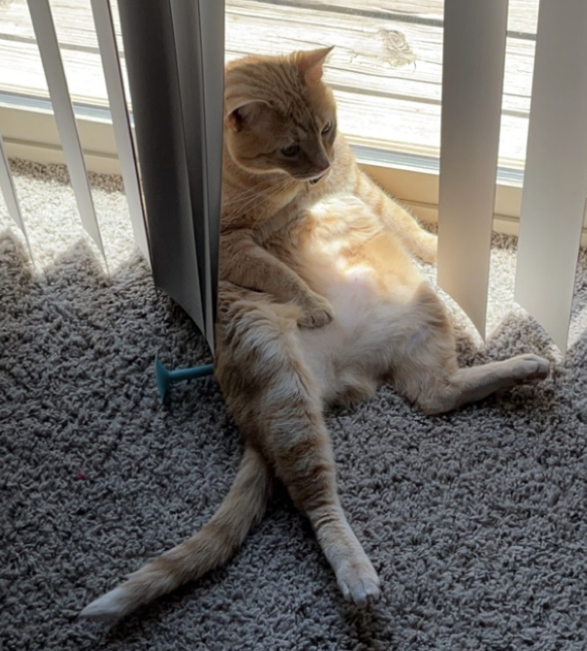

```{r setup, include=FALSE}
knitr::opts_chunk$set(echo = FALSE)
```

## In Serious

- I am still obsessed with Taylor Swift, even in this slides set.
- I am a statistics Grad Student at UNL. I'll hopefully get my Master's in Spring 2024.
- My birthday is April 24th. Some celeb birthday twins include: 
  - Kelly Clarkson (I really hope you know who Kelly is...)
  - Joe Keery (From Stranger Things)
  - Barbra Streisand (A legend. Love.)


## Winder

This is just a slide of Winder.

{width=40%} {width=40%}

## SA plot. The same dino one.

```{r, eval=T, echo=T, message=F, out.width="50%", fig.align='center'}
library(datasauRus)
library(tidyverse)
dino <- filter(datasaurus_dozen, dataset=='dino')
ggplot(aes(x=x, y=y), data=dino)+geom_point(color='#007200')
```

## And my CV

And the [link](https://charlestbonk.github.io/CV-Bonk/CV-Bonk.pdf) to her.


